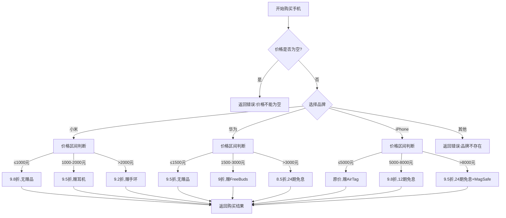
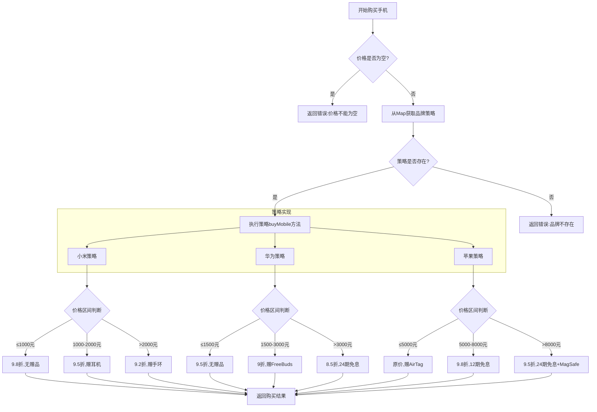
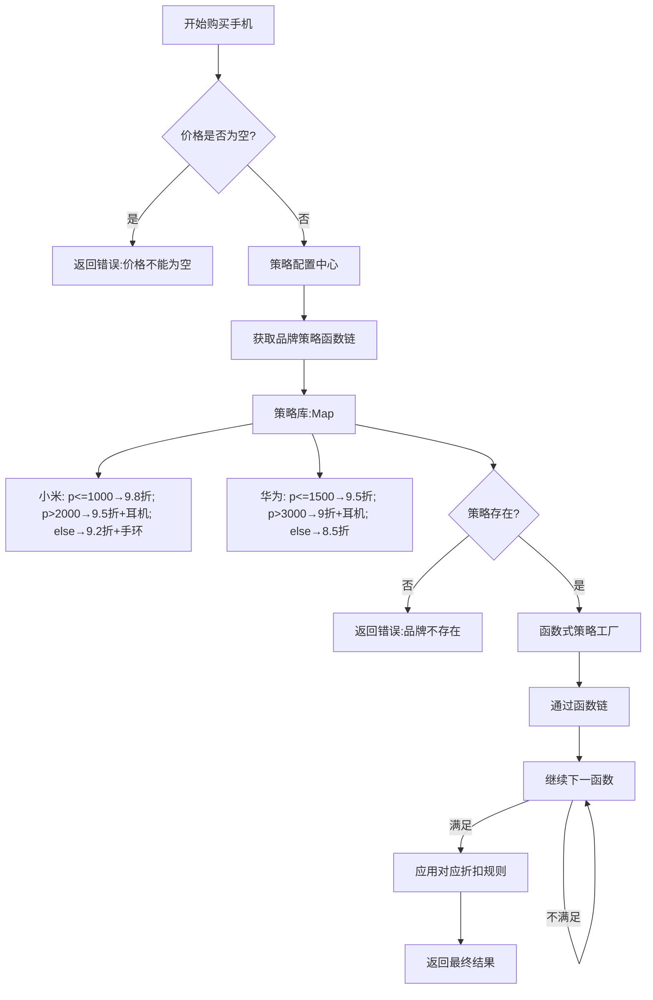
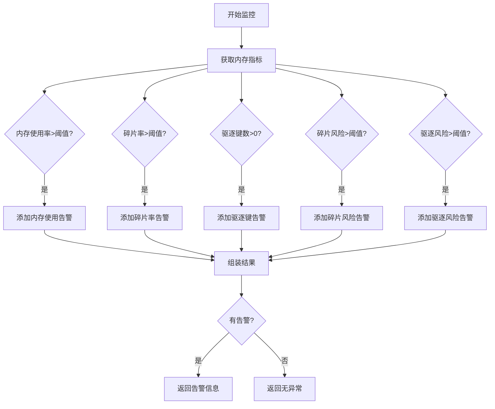
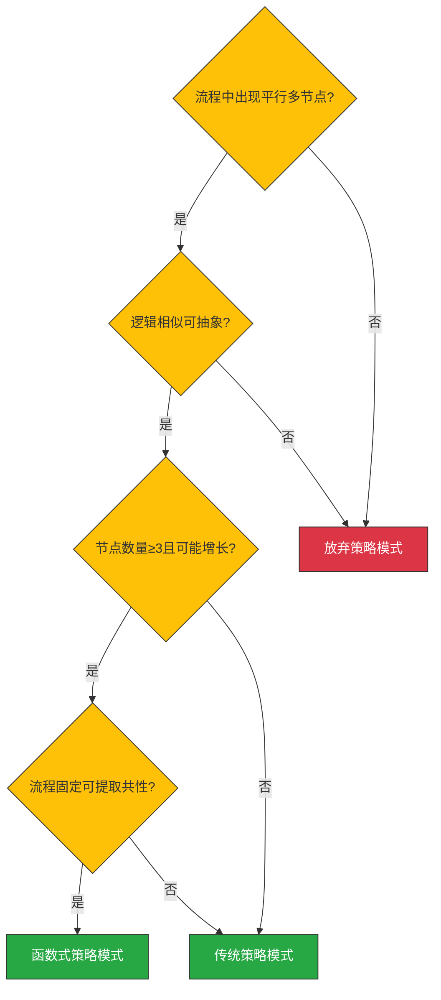

# 0811——设计模式：Java 策略模式 | 规则对象化

## 前言

1. Java 策略模式是经常使用的一个设计模式，其通过规则驱动，将不同的规则以及不同的实现逻辑，通过封装成类，实现消除复杂的平行规则。
2. 而传统的策略模式属于类级别抽象，一个规则会抽象成类级别，策略模式虽然**不复杂**，但是**很笨重。**
3. 而轻量级的策略模式，则把类级别抽象换为函数级别抽象，将相似的规则、相似的逻辑一同封装进一个函数接口中，通过 Lambda 表达式进行不同规则的编写。
4. 这种**函数级策略模式**，是即时创建、即时使用、即时删除的，避免了传统策略模式导致的类爆炸，同时又沿用了策略模式的高可拓展、高可维护性。
5. **函数级策略模式**在特定场景下，对传统策略模式有着碾压级别的优势，但是并不意味着传统策略模式会被替代，在特定的情况下，其依旧是消除代码大规模显性规则的利器。（例如 if 膨胀问题）

## Let's Start!

### 传统策略模式

#### 场景描述

1. 现需要一个方法，不同的手机品牌会有不同的折扣，而该折扣是分阶段实行的，给出以下几种折扣方式

<table>
<tr>
<td>品牌<br/></td><td>价格区间<br/></td><td>折扣率<br/></td><td>附加优惠<br/></td></tr>
<tr>
<td>小米<br/></td><td>≤ 1000元<br/></td><td>9.8折<br/></td><td>无<br/></td></tr>
<tr>
<td><br/></td><td>1000元 < 价格 ≤ 2000元<br/></td><td>9.5折<br/></td><td>赠有线耳机<br/></td></tr>
<tr>
<td><br/></td><td>价格 > 2000元<br/></td><td>9.2折<br/></td><td>赠小米手环<br/></td></tr>
</table>

<table>
<tr>
<td>品牌<br/></td><td>价格区间<br/></td><td>折扣率<br/></td><td>附加优惠<br/></td></tr>
<tr>
<td>华为<br/></td><td>≤ 1500元<br/></td><td>9.5折<br/></td><td>无<br/></td></tr>
<tr>
<td><br/></td><td>1500元 < 价格 ≤ 3000元  <br/></td><td>9折<br/></td><td>赠FreeBuds SE<br/></td></tr>
<tr>
<td><br/></td><td>价格 > 3000元<br/></td><td>8.5折<br/></td><td>24期免息<br/></td></tr>
</table>

<table>
<tr>
<td>品牌<br/></td><td>价格区间<br/></td><td>折扣率<br/></td><td>附加优惠<br/></td></tr>
<tr>
<td>iPhone<br/></td><td>≤ 5000元<br/></td><td>无折扣<br/></td><td>赠AirTag<br/></td></tr>
<tr>
<td><br/></td><td>5000元 < 价格 ≤ 8000元<br/></td><td>9.8折<br/></td><td>12期免息<br/></td></tr>
<tr>
<td><br/></td><td>价格 > 8000元<br/></td><td>9.5折<br/></td><td>24期免息 + 赠MagSafe<br/></td></tr>
</table>

#### 代码实现

##### 核心方法实现

```java
_/**_
_ * 手机服务类_
_ *_
_ * _**@author **_王玉涛_
_ * _**@version **_1.0_
_ * _**@since **_2025/8/12_
_ */_
@Slf4j
@Service
public class MobileService {

    _/**_
_     * 购买手机_
_     *_
_     * _**@param **_mobileBrand 手机品牌_
_     * _**@param **_price       手机价格_
_     * _**@return **_购买结果_
_     */_
_    _public String buyMobile(String mobileBrand, Integer price) {
        StringBuilder buyResult = new StringBuilder();

        if (price == null) {
            buyResult.append("手机价格不能为空");
            return buyResult.toString();
        }

        if (_MobileBrand_._XIAOMI_.getBrand().equals(mobileBrand)) {
            _// 小米品牌，根据价格进行购买逻辑_
_            _if (price <= 1000) {
                buyResult.append("购买小米手机成功,").append("手机价格: ").append(Double._valueOf_(price) * 0.98D);
            } else if (price <= 2000) {
                buyResult.append("购买小米手机成功,").append("手机价格: ").append(Double._valueOf_(price) * 0.95D).append(" 附赠有线耳机");
            } else {
                buyResult.append("购买小米手机成功,").append("手机价格: ").append(Double._valueOf_(price) * 0.9D).append(" 附赠小米手环");
            }
        } else if (_MobileBrand_._HUAWEI_.getBrand().equals(mobileBrand)) {
            _// 华为品牌，根据价格进行购买逻辑_
_            _if (price <= 1500) {
                buyResult.append("购买华为手机成功,").append("手机价格: ").append(Double._valueOf_(price) * 0.95D);
            } else if (price <= 3000) {
                buyResult.append("购买华为手机成功,").append("手机价格: ").append(Double._valueOf_(price) * 0.9D).append(" 附赠FreeBuds SE");
            } else {
                buyResult.append("购买华为手机成功,").append("手机价格: ").append(Double._valueOf_(price) * 0.85D).append(" 24期免息");
            }
        } else if (_MobileBrand_._APPLE_.getBrand().equals(mobileBrand)) {
            _// 苹果品牌，根据价格进行购买逻辑_
_            _if (price <= 5000) {
                buyResult.append("购买苹果手机成功,").append("手机价格: ").append(price).append(" 附赠AirTag");
            } else if (price <= 8000) {
                buyResult.append("购买苹果手机成功,").append("手机价格: ").append(Double._valueOf_(price) * 0.98D).append(" 12期免息");
            } else {
                buyResult.append("购买苹果手机成功,").append("手机价格: ").append(Double._valueOf_(price) * 0.95D).append(" 24期免息 附赠MagSafe");
            }
        } else {
            buyResult.append("手机品牌不存在");
        }

        return buyResult.toString();
    }
}
```

可以看出，代码中的 if 有了嵌套层级，且略显臃肿，我们进行逻辑提取，进行初步优化

##### 初步优化版本

```typescript
_/**_
_ * 手机服务类_
_ *_
_ * _**@author **_王玉涛_
_ * _**@version **_1.0_
_ * _**@since **_2025/8/12_
_ */_
@Slf4j
@Service
public class MobileService {

    _/**_
_     * 购买手机_
_     *_
_     * _**@param **_mobileBrand 手机品牌_
_     * _**@param **_price       手机价格_
_     * _**@return **_购买结果_
_     */_
_    _public String buyMobile(String mobileBrand, Integer price) {
        StringBuilder buyResult = new StringBuilder();

        if (price == null) {
            buyResult.append("手机价格不能为空");
            return buyResult.toString();
        }

        if (_MobileBrand_._XIAOMI_.getBrand().equals(mobileBrand)) {
            _buyXiaoMi_(_price_, buyResult);
        } else if (_MobileBrand_._HUAWEI_.getBrand().equals(mobileBrand)) {
            _buyHuaWei_(price, buyResult);
        } else if (_MobileBrand_._APPLE_.getBrand().equals(mobileBrand)) {
            _buyApple_(price, buyResult);
        } else {
            buyResult.append("手机品牌不存在");
        }

        return buyResult.toString();
    }

    _/**_
_     * 购买苹果手机_
_     *_
_     * _**@param **_price      价格_
_     * _**@param **_buyResult  结果_
_     */_
_    _private static void buyApple(Integer price, StringBuilder buyResult) {
        _// 苹果品牌，根据价格进行购买逻辑_
_        _if (price <= 5000) {
            buyResult.append("购买苹果手机成功,").append("手机价格: ").append(price).append(" 附赠AirTag");
        } else if (price <= 8000) {
            buyResult.append("购买苹果手机成功,").append("手机价格: ").append(Double._valueOf_(price) * 0.98D).append(" 12期免息");
        } else {
            buyResult.append("购买苹果手机成功,").append("手机价格: ").append(Double._valueOf_(price) * 0.95D).append(" 24期免息 附赠MagSafe");
        }
    }

    _/**_
_     * 购买华为手机_
_     *_
_     * _**@param **_price 手机价格_
_     * _**@param **_buyResult 购买结果_
_     */_
_    _private static void buyHuaWei(Integer price, StringBuilder buyResult) {
        _// 华为品牌，根据价格进行购买逻辑_
_        _if (price <= 1500) {
            buyResult.append("购买华为手机成功,").append("手机价格: ").append(Double._valueOf_(price) * 0.95D);
        } else if (price <= 3000) {
            buyResult.append("购买华为手机成功,").append("手机价格: ").append(Double._valueOf_(price) * 0.9D).append(" 附赠FreeBuds SE");
        } else {
            buyResult.append("购买华为手机成功,").append("手机价格: ").append(Double._valueOf_(price) * 0.85D).append(" 24期免息");
        }
    }

    _/**_
_     * 购买小米手机_
_     *_
_     * _**@param **_price 手机价格_
_     * _**@param **_buyResult 购买结果_
_     */_
_    _private static void buyXiaoMi(Integer price, StringBuilder buyResult) {
        _// 小米品牌，根据价格进行购买逻辑_
_        _if (price <= 1000) {
            buyResult.append("购买小米手机成功,").append("手机价格: ").append(Double._valueOf_(price) * 0.98D);
        } else if (price <= 2000) {
            buyResult.append("购买小米手机成功,").append("手机价格: ").append(Double._valueOf_(price) * 0.95D).append(" 附赠有线耳机");
        } else {
            buyResult.append("购买小米手机成功,").append("手机价格: ").append(Double._valueOf_(price) * 0.9D).append(" 附赠小米手环");
        }
    }
}
```

此时已经消除了显性的代码嵌套，但是依旧存在着复杂的 if 逻辑，并且也是存在着隐性 if 嵌套，因此我们就可以通过策略模式，来消除一部分的 if 逻辑，消除这种隐性的 if 嵌套

#### 优化思路

1. 当前的逻辑流程图是这样的



- 可以看出，当前的流程图有着以下特点
  - 在某一个节点会衍生出多种情况
  - 每种情况的逻辑都是类似（判断价格区间，进行对应的购买逻辑）
  - 如果是以代码翻译，就会出现多 if else，在代码层面，甚至出现嵌套 if，并且难以真正消除 if 嵌套

1. 因此我们并不一定说，必须在代码层面就能看出来什么时候需要抽象，通过对流程图进行分析，或许可以更快找到优化方案
2. 将不同品牌对应的价格区间判断 + 购买逻辑，抽象成接口：`MobileBrandStrategy` 然后通过定义不同的实现类：`XiaoMiStrategy` `HuaWeiStrategy` 等。
3. 以接口接受不同实现类，这一逻辑通过 MobileFactory 进行封装，随后只需要调用相关的接口方法，即可获取到对应的购买结果
4. 通过这样的优化，我们可以将第一层选择：根据不同的品牌选择不同的策略方法，抽象成为类级别，消除了第二层的 if。后续再添加其他的业务逻辑（例如添加红米手机的折扣策略），只需要添加类方法，而不需要在原方法内部进行 if 分支的增加。提高了可拓展性
5. 因此，策略模式的优势就是可以消除最外层的 if 条件选择，并且符合开闭原则，也就是说，无需在方法层面上进行代码的更改（即使是添加代码，不删改，也是不符合开闭原则的），只需要添加新的类，修改工厂类中的创建对象逻辑，即可完成业务逻辑的拓展。
6. 当然，这里依旧有些缺陷，即需要在工厂方法中进行对应的修改，并且这里也涉及到了 if 逻辑，这种优化是不彻底的，本质上是将最外层的分支选择，抽象成了针对策略类的选择。因此后续我们也会继续讲解针对这里的优化逻辑

#### 进一步改造

- 策略接口提供

```java
_/**_
_ * 手机品牌策略类，专注于针对不同的手机品牌进行不同的策略方式选择_
_ *_
_ * _**@author **_王玉涛_
_ * _**@version **_1.0_
_ * _**@since **_2025/8/12_
_ */_
public interface _MobileBrandStrategy _{

    _/**_
_     * 手机购买策略_
_     *_
_     * _**@param **_price     手机价格_
_     * _**@param **_buyResult 手机购买结果_
_     * _**@return **_手机购买结果_
_     */_
_    _StringBuilder buyMobile(Integer price, StringBuilder buyResult);
}
```

- 策略类提供

```java
/**
 * 基于小米品牌实现的策略类
 *
 * @author 王玉涛
 * @version 1.0
 * @since 2025/8/12
 */
@Component
public class XiaoMiStrategy implements MobileBrandStrategy {

    /**
     * 手机购买策略
     *
     * @param price     手机价格
     * @param buyResult 购买结果
     * @return 手机购买结果
     */
    @Override
    public StringBuilder buyMobile(Integer price, StringBuilder buyResult) {
        // 小米品牌，根据价格进行购买逻辑
        if (price <= 1000) {
            buyResult.append("购买小米手机成功,").append("手机价格: ").append(Double.valueOf(price) * 0.98D);
        } else if (price <= 2000) {
            buyResult.append("购买小米手机成功,").append("手机价格: ").append(Double.valueOf(price) * 0.95D).append(" 附赠有线耳机");
        } else {
            buyResult.append("购买小米手机成功,").append("手机价格: ").append(Double.valueOf(price) * 0.9D).append(" 附赠小米手环");
        }

        return buyResult;
    }
}
```

```java
_/**_
_ * 基于华为品牌实现的策略类_
_ *_
_ * _**@author **_王玉涛_
_ * _**@version **_1.0_
_ * _**@since **_2025/8/12_
_ */_
@Component
public class HuaWeiStrategy implements _MobileBrandStrategy _{
    _/**_
_     * 手机购买策略_
_     *_
_     * _**@param **_price     手机价格_
_     * _**@param **_buyResult 手机购买结果_
_     * _**@return **_手机购买结果_
_     */_
_    _@Override
    public StringBuilder buyMobile(Integer price, StringBuilder buyResult) {
        _// 华为品牌，根据价格进行购买逻辑_
_        _if (_price _<= 1500) {
            _buyResult_.append("购买华为手机成功,").append("手机价格: ").append(Double._valueOf_(price) * 0.95D);
        } else if (price <= 3000) {
            buyResult.append("购买华为手机成功,").append("手机价格: ").append(Double._valueOf_(price) * 0.9D).append(" 附赠FreeBuds SE");
        } else {
            buyResult.append("购买华为手机成功,").append("手机价格: ").append(Double._valueOf_(price) * 0.85D).append(" 24期免息");
        }
        return buyResult;
    }
}
```

```java
_/**_
_ * 基于苹果品牌的策略方式_
_ *_
_ * _**@author **_王玉涛_
_ * _**@version **_1.0_
_ * _**@since **_2025/8/12_
_ */_
@Component
public class AppleStrategy implements _MobileBrandStrategy _{

    _/**_
_     * 手机购买策略_
_     *_
_     * _**@param **_price     手机价格_
_     * _**@param **_buyResult 手机购买结果_
_     * _**@return **_手机购买结果_
_     */_
_    _@Override
    public StringBuilder buyMobile(Integer price, StringBuilder buyResult) {
        _// 苹果品牌，根据价格进行购买逻辑_
_        _if (price <= 5000) {
            buyResult.append("购买苹果手机成功,").append("手机价格: ").append(price).append(" 附赠AirTag");
        } else if (price <= 8000) {
            buyResult.append("购买苹果手机成功,").append("手机价格: ").append(Double._valueOf_(price) * 0.98D).append(" 12期免息");
        } else {
            buyResult.append("购买苹果手机成功,").append("手机价格: ").append(Double._valueOf_(price) * 0.95D).append(" 24期免息 附赠MagSafe");
        }

        return buyResult;
    }
}
```

- 工厂类提供

```java
_/**_
_ * 手机品牌策略工厂类_
_ * <p>_
_ * 该工厂类根据传入的手机品牌名称，返回对应的手机品牌策略实现类。_
_ * 支持的品牌包括：小米、华为、苹果。_
_ * </p>_
_ *_
_ * _**@author **_王玉涛_
_ * _**@version **_1.0_
_ * _**@since **_2025/8/12_
_ */_
public class MobileStrategyFactory {

    _/**_
_     * 私有构造函数，防止外部实例化_
_     */_
_    _private MobileStrategyFactory() {}
    
    _/**_
_     * 根据手机品牌名称获取对应的策略实现类_
_     * <p>_
_     * 通过比较传入的品牌名称与枚举类中定义的品牌名称，返回相应的策略对象。_
_     * 如果没有匹配的品牌，则返回 null。_
_     * </p>_
_     *_
_     * _**@param **_mobileBrand 手机品牌名称_
_     * _**@return **_对应的手机品牌策略实现类，如果未找到则返回 null_
_     */_
_    _public static _MobileBrandStrategy _getMobileStrategy(String mobileBrand) {
        if (_MobileBrand_._XIAOMI_.getBrand().equals(mobileBrand)) {
            return new XiaoMiStrategy();
        } else if (_MobileBrand_._HUAWEI_.getBrand().equals(mobileBrand)) {
            return new HuaWeiStrategy();
        } else if (_MobileBrand_._APPLE_.getBrand().equals(mobileBrand)) {
            return new AppleStrategy();
        } else {
            return null;
        }
    }
}
```

- 核心类提供

```java
_/**_
_ * 手机服务类_
_ *_
_ * _**@author **_王玉涛_
_ * _**@version **_1.0_
_ * _**@since **_2025/8/12_
_ */_
@Slf4j
@Service
public class MobileService {

    _/**_
_     * 购买手机_
_     *_
_     * _**@param **_mobileBrand 手机品牌_
_     * _**@param **_price       手机价格_
_     * _**@return **_购买结果_
_     */_
_    _public String buyMobile(String mobileBrand, Integer price) {
        StringBuilder buyResult = new StringBuilder();

        if (price == null) {
            buyResult.append("手机价格不能为空");
            return buyResult.toString();
        }

        _MobileBrandStrategy _mobileStrategy = MobileStrategyFactory._getMobileStrategy_(_mobileBrand_);
        buyResult = Objects._isNull_(mobileStrategy) ? buyResult.append("手机品牌不能为空") : mobileStrategy.buyMobile(price, buyResult);
        return buyResult.toString();
    }
}
```

#### 改造后总结

1. 改造后的流程图如下

```mermaid
flowchart TD
    A[开始购买手机] --> B{价格是否为空?}
    B -->|是| C[返回错误:价格不能为空]
    B -->|否| D[策略工厂获取品牌策略]
    D --> E{策略是否存在?}
    E -->|否| F[返回错误:品牌不存在]
    E -->|是| G[执行策略buyMobile方法]
    
    subgraph 策略实现
        G --> H[小米策略]
        G --> I[华为策略]
        G --> J[苹果策略]
    end
    
    H --> K{价格区间判断}
    K -->|≤1000元| K1[9.8折,无赠品]
    K -->|1000-2000元| K2[9.5折,赠耳机]
    K -->|>2000元| K3[9.2折,赠手环]
    
    I --> L{价格区间判断}
    L -->|≤1500元| L1[9.5折,无赠品]
    L -->|1500-3000元| L2[9折,赠FreeBuds]
    L -->|>3000元| L3[8.5折,24期免息]
    
    J --> M{价格区间判断}
    M -->|≤5000元| M1[原价,赠AirTag]
    M -->|5000-8000元| M2[9.8折,12期免息]
    M -->|>8000元| M3[9.5折,24期免息+MagSafe]
    
    K1 & K2 & K3 & L1 & L2 & L3 & M1 & M2 & M3 --> N[返回购买结果]
```



1. 优化后，品牌选择逻辑封装到工厂中
2. 所有策略实现统一接口
3. 价格区间判断从主流程下沉到各策略内部
4. 新增品牌只需在策略实现子图中添加节点

#### 最终优化方案

##### 优化思路

1. 上一次我们提到了工厂中依旧存在着根据 if 进行不同条件的返回。
2. 也就是说，当我们新增一个策略类，仍旧需要进行 if-else 的分支增加。
3. 换句话说，我们依旧是需要使用 if-else 的普通映射模式，但是我们可以更换一种方式，让工厂类实现自动注入映射关系。
4. 也就是说，通过反射 +Map，实现一对一映射，从而彻底消除 if-else，实现最终优化。
5. 而 SpringBoot 可以直接注入一个接口下的所有实现类，只要实现类进行了 Bean 注册，即可通过构造方法进行自动化注入。

##### 最终优化代码

- 对应的接口改动

```java
_/**_
_ * 手机品牌策略类，专注于针对不同的手机品牌进行不同的策略方式选择_
_ *_
_ * _**@author **_王玉涛_
_ * _**@version **_1.0_
_ * _**@since **_2025/8/12_
_ */_
public interface _MobileBrandStrategy _{

    _/**_
_     * 手机购买策略_
_     *_
_     * _**@param **_price     手机价格_
_     * _**@param **_buyResult 手机购买结果_
_     * _**@return **_手机购买结果_
_     */_
_    _StringBuilder buyMobile(Integer price, StringBuilder buyResult);

    _/**_
_     * 获取手机品牌_
_     *_
_     * _**@return **_手机品牌_
_     */_
_    _String getBrand();
}
```

- 其中一个类的改动（其他的类遵循类似改动即可）

```typescript
_/**_
_ * 基于小米品牌实现的策略类_
_ *_
_ * _**@author **_王玉涛_
_ * _**@version **_1.0_
_ * _**@since **_2025/8/12_
_ */_
@Data
@Component
public class XiaoMiStrategy implements _MobileBrandStrategy _{

    private String brand = _MobileBrand_._XIAOMI_.getBrand();

    _/**_
_     * 手机购买策略_
_     *_
_     * _**@param **_price     手机价格_
_     * _**@param **_buyResult 购买结果_
_     * _**@return **_手机购买结果_
_     */_
_    _@Override
    public StringBuilder buyMobile(Integer price, StringBuilder _buyResult_) {
        _// 小米品牌，根据价格进行购买逻辑_
_        _if (_price _<= 1000) {
            _buyResult_.append("购买小米手机成功,").append("手机价格: ").append(Double._valueOf_(price) * 0.98D);
        } else if (price <= 2000) {
            buyResult.append("购买小米手机成功,").append("手机价格: ").append(Double._valueOf_(price) * 0.95D).append(" 附赠有线耳机");
        } else {
            buyResult.append("购买小米手机成功,").append("手机价格: ").append(Double._valueOf_(price) * 0.9D).append(" 附赠小米手环");
        }
        return buyResult;
    }
}
```

- 工厂改动（通过 Spring 以来机制进行注入）

```typescript
_/**_
_ * 手机品牌策略工厂类_
_ * <p>_
_ * 该工厂类根据传入的手机品牌名称，返回对应的手机品牌策略实现类。_
_ * 支持的品牌包括：小米、华为、苹果。_
_ * </p>_
_ *_
_ * _**@author **_王玉涛_
_ * _**@version **_1.0_
_ * _**@since **_2025/8/12_
_ */_
@Component
public class MobileStrategyFactory {

    _/**_
_     * 存储手机品牌与对应策略实现类映射关系的静态Map_
_     * key: 手机品牌名称_
_     * value: 对应的手机品牌策略实现类_
_     */_
_    _private static final _Map_<String, _MobileBrandStrategy_> _MOBILE_BRAND_STRATEGY_MAP_;

    _// 静态初始化块，初始化策略映射Map_
_    _static {
        _MOBILE_BRAND_STRATEGY_MAP _= new HashMap<>();
    }

    _/**_
_     * 构造函数，通过Spring注入的所有手机品牌策略实现类列表来初始化策略映射Map_
_     *_
_     * _**@param **_mobileBrandStrategies Spring容器中所有实现了MobileBrandStrategy接口的Bean列表_
_     */_
_    _public MobileStrategyFactory(_List_<_MobileBrandStrategy_> mobileBrandStrategies) {
        _// 遍历所有手机品牌策略实现类_
_        _for (_MobileBrandStrategy _mobileBrandStrategy : mobileBrandStrategies) {
            _// 获取策略实现类对应的手机品牌_
_            _String brand = mobileBrandStrategy.getBrand();
            _// 将手机品牌与对应的策略实现类存入映射Map中_
_            MOBILE_BRAND_STRATEGY_MAP_.put(brand, mobileBrandStrategy);
        }
    }

    _/**_
_     * 根据手机品牌名称获取对应的策略实现类_
_     * <p>_
_     * 通过比较传入的品牌名称与已注册的品牌名称，返回相应的策略对象。_
_     * 如果没有匹配的品牌，则返回 null。_
_     * </p>_
_     *_
_     * _**@param **_mobileBrand 手机品牌名称_
_     * _**@return **_对应的手机品牌策略实现类，如果未找到则返回 null_
_     */_
_    _public _MobileBrandStrategy _getMobileStrategy(String mobileBrand) {
        _// 从映射Map中获取对应品牌的策略实现类_
_        _return _MOBILE_BRAND_STRATEGY_MAP_.get(mobileBrand);
    }
}
```

- 核心类实现

```java
_/**_
_ * 手机服务类_
_ *_
_ * _**@author **_王玉涛_
_ * _**@version **_1.0_
_ * _**@since **_2025/8/12_
_ */_
@Slf4j
@Service
@RequiredArgsConstructor
public class MobileService {

    private final MobileStrategyFactory mobileStrategyFactory;

    _/**_
_     * 购买手机_
_     *_
_     * _**@param **_mobileBrand 手机品牌_
_     * _**@param **_price       手机价格_
_     * _**@return **_购买结果_
_     */_
_    _public String buyMobile(String mobileBrand, Integer price) {
        StringBuilder buyResult = new StringBuilder();

        if (price == null) {
            buyResult.append("手机价格不能为空");
            return buyResult.toString();
        }

        _MobileBrandStrategy _mobileStrategy = mobileStrategyFactory.getMobileStrategy(_mobileBrand_);
        buyResult = Objects._isNull_(mobileStrategy) ? buyResult.append("手机品牌不能为空") : mobileStrategy.buyMobile(price, buyResult);
        return buyResult.toString();
    }
}
```

##### 对应流程图



#### 总结

1. 策略模式，是通过将流程图中的多个可选择，且逻辑类似的平行节点抽象成类，不同的策略类负责对应的单一职责，从而消除了显性的内部逻辑。
2. 又通过工厂模式，封装不同策略类选择的过程，将最外层的节点选择流程进行隐藏，从而实现了基础版本的策略模式。
3. 而通过 Spring 的依赖注入机制，将对应的策略接口下的所有策略实现类进行依赖注入，在初始化构造函数中实现好对 Map 的存储。从而实现对工厂的映射模式的底层改进（if/switch 分支选择 ——> Hash 映射）
4. 通过这种修改，实现了将复杂的分支选择，转化为 Hash 映射，以及对应的分支的逻辑，下沉到对应的实现类中，如果要拓展新的分支方法，只需要添加新方法，符合开闭原则，大大提高了代码的可维护性以及可拓展性。

### 函数级策略模式

#### 场景描述

同 1.1 一样，我们依旧是通过这种形式来进行讲述，并进行函数级别优化，最后我们进行对比，说明这两种策略模式都适合在什么时候进行使用。

#### 优化思路

1. 当前传统的策略模式，其主要思路就是通过将具有相似逻辑的平行节点，抽象成一个接口，再对应每个节点进行对应实现。并通过工厂模式，使用 Map 形式进行 O(1)级别的映射。
2. 但是有一个问题就是，当流程几乎固定，且使用次数不超过三次，以及对应的平行节点不断增加，那么对应的策略类也会发生膨胀，而其内部的逻辑几乎是固定的，这也就导致加载过程中，要进行大量的类级别加载，而内部逻辑流程固定，会产生资源浪费。
3. 针对这一种情况，我们可以进一步进行抽象，将类级别的抽象，换成函数级别的抽象，当流程几乎固定不变，且不会很复杂的时候，函数级策略模式就起到了更佳的优势。
4. 针对我们当前的场景：每个品牌的折扣方式几乎固定（都是分阶段进行不同折扣，以及不同的附加优惠）。那么我们可以在传统策略实现的基础上，进一步进行抽象。
5. 三个手机品牌会对价格进行区间定位，根据不同的区间定位，实现不同的折扣策略。也就是说，我们可以抽象出来一个函数接口列表，返回值为 Boolean，根据其满足的区间，进行不同级别的折扣策略。
6. 新版流程图如下



#### 对应代码实现

- 规则类实现（相似流程，函数级别抽象，更轻量）

```typescript
_/**_
_ * 手机品牌折扣规则类，通过函数式接口实现策略模式的轻量级替换_
_ * 该类封装了不同品牌的折扣规则，支持动态匹配和计算折扣价格_
_ *_
_ * _**@author **_王玉涛_
_ * _**@version **_1.0_
_ * _**@since **_2025/8/12_
_ */_
@Data
@AllArgsConstructor
public class MobileBrandAccountRule {
    _/**_
_     * 折扣条件判断函数列表，每个函数接收价格参数，返回是否满足折扣条件_
_     */_
_    _private _List_<_Function_<Integer, Boolean>> isAccounts;
    
    _/**_
_     * 折扣率列表，与isAccounts一一对应，表示满足条件时的价格折扣倍数_
_     */_
_    _private _List_<Double> accounts;
    
    _/**_
_     * 优惠结果描述列表，与isAccounts一一对应，表示满足条件时的优惠说明_
_     */_
_    _private _List_<String> accountResults;
    
    _/**_
_     * 手机品牌名称_
_     */_
_    _private String mobileBrand;
    
    _/**_
_     * 根据手机价格和折扣规则计算购买结果_
_     * 遍历所有折扣规则，找到第一个满足条件的规则并应用折扣_
_     *_
_     * _**@param **_price 手机原价_
_     * _**@param **_sb    结果构建器，用于拼接购买结果信息_
_     * _**@return **_包含购买结果信息的StringBuilder对象_
_     */_
_    _public StringBuilder buyMobile(Integer price, StringBuilder sb) {
        int size = isAccounts.size();
        for (int i = 0; i < size; i++) {
            _Function_<Integer, Boolean> isAccount = isAccounts.get(i);
            Boolean inAccount = isAccount.apply(_price_);
            if (inAccount) {
                _sb_.append("手机购买成功, ")
                        .append("手机价格: ")
                        .append(Double._valueOf_(price) * accounts.get(i))
                        .append(",")
                        .append("优惠附加: ")
                        .append(accountResults.get(i));
                return _sb_;
            }
        }
        return _sb_.append("手机购买失败");
    }
}
```

- 工厂封装（需要添加实现类，只需要在工厂中添加对应的实现方法）

```typescript
_/**_
_ * 手机品牌折扣规则工厂类_
_ * 该工厂负责创建和管理不同品牌的折扣规则，通过策略模式实现规则的灵活扩展_
_ * 如果要添加新品牌实现，只需要在工厂中添加对应的实现方法_
_ *_
_ * _**@author **_王玉涛_
_ * _**@version **_1.0_
_ * _**@since **_2025/8/12_
_ */_
public class MobileBrandAccountRuleFactory {
    
    _/**_
_     * 手机品牌折扣规则缓存_
_     */_
_    _private MobileBrandAccountRuleFactory() {}

    _/**_
_     * 存储各品牌折扣规则的映射表_
_     * key: 品牌名称_
_     * value: 对应的折扣规则对象_
_     */_
_    _private static final _Map_<String, MobileBrandAccountRule> _MOBILE_BRAND_ACCOUNT_RULE_MAP_;

    static {
        _// 初始化各品牌折扣规则映射表_
_        MOBILE_BRAND_ACCOUNT_RULE_MAP _= _Map_._of_(
                _// 小米品牌折扣规则配置_
_                MobileBrand_._XIAOMI_.getBrand(),
                new MobileBrandAccountRule(
                        _// 价格区间判断条件列表_
_                        List_._of_(
                                _// 价格小于等于1000元_
_                                price _-> _price _<= 1000,
                                _// 价格小于等于2000元_
_                                price _-> _price _<= 2000,
                                _// 价格大于2000元_
_                                _price -> price > 2000
                        ),
                        _// 对应的折扣率列表_
_                        List_._of_(
                                _// 98折_
_                                _0.98D,
                                _// 95折_
_                                _0.95D,
                                _// 92折_
_                                _0.92D
                        ),
                        _// 对应的优惠赠品列表_
_                        List_._of_(
                                _// 无赠品_
_                                _"",
                                _// 赠送有线耳机_
_                                _"赠有线耳机",
                                _// 赠送小米手环_
_                                _"赠小米手环"
                        ),
                        _MobileBrand_._XIAOMI_.getBrand()
                ),
                _// 华为品牌折扣规则配置_
_                MobileBrand_._HUAWEI_.getBrand(),
                new MobileBrandAccountRule(
                        _// 价格区间判断条件列表_
_                        List_._of_(
                                _// 价格小于等于1500元_
_                                _price -> price <= 1500,
                                _// 价格小于等于3000元_
_                                _price -> price <= 3000,
                                _// 价格大于3000元_
_                                _price -> price > 3000
                        ),
                        _// 对应的折扣率列表_
_                        List_._of_(
                                _// 98折_
_                                _0.98D,
                                _// 95折_
_                                _0.95D,
                                _// 92折_
_                                _0.92D
                        ),
                        _// 对应的优惠赠品列表_
_                        List_._of_(
                                _// 无赠品_
_                                _"",
                                _// 赠送FreeBuds SE耳机_
_                                _"赠FreeBuds SE",
                                _// 提供24期免息分期_
_                                _"24期免息"
                        ),
                        _MobileBrand_._HUAWEI_.getBrand()
                ),
                _// 苹果品牌折扣规则配置_
_                MobileBrand_._APPLE_.getBrand(),
                new MobileBrandAccountRule(
                        _// 价格区间判断条件列表_
_                        List_._of_(
                                _// 价格小于等于5000元_
_                                _price -> price <= 5000,
                                _// 价格小于等于8000元_
_                                _price -> price <= 8000,
                                _// 价格大于8000元_
_                                _price -> price > 8000
                        ),
                        _// 对应的折扣率列表_
_                        List_._of_(
                                _// 无折扣_
_                                _1.00D,
                                _// 98折_
_                                _0.98D,
                                _// 95折_
_                                _0.95D
                        ),
                        _// 对应的优惠赠品列表_
_                        List_._of_(
                                _// 赠送AirTag_
_                                _"赠AirTag",
                                _// 提供12期免息分期_
_                                _"12期免息",
                                _// 提供24期免息分期并赠送MagSafe_
_                                _"24期免息 + 赠MagSafe"
                        ),
                        _MobileBrand_._APPLE_.getBrand()
                )
        );
    }
    
    
    _/**_
_     * 根据品牌名称获取对应的折扣规则_
_     *_
_     * _**@param **_brand 品牌名称_
_     * _**@return **_对应的折扣规则对象，如果找不到则返回null_
_     */_
_    _public static MobileBrandAccountRule getMobileBrandAccountRule(String brand) {
        return _MOBILE_BRAND_ACCOUNT_RULE_MAP_.get(brand);
    }
}
```

- 核心类使用（几乎无改动）

```java
_/**_
_ * 手机服务类_
_ *_
_ * _**@author **_王玉涛_
_ * _**@version **_1.0_
_ * _**@since **_2025/8/12_
_ */_
@Slf4j
@Service
@RequiredArgsConstructor
public class MobileService {

    _/**_
_     * 购买手机_
_     *_
_     * _**@param **_mobileBrand 手机品牌_
_     * _**@param **_price       手机价格_
_     * _**@return **_购买结果_
_     */_
_    _public String buyMobile(String mobileBrand, Integer price) {
        StringBuilder buyResult = new StringBuilder();

        if (price == null) {
            buyResult.append("手机价格不能为空");
            return buyResult.toString();
        }

        MobileBrandAccountRule mobileBrandAccountRule = MobileBrandAccountRuleFactory._getMobileBrandAccountRule_(mobileBrand);
        buyResult = Objects._isNull_(mobileBrandAccountRule) ? buyResult.append("手机品牌不能为空") : mobileBrandAccountRule.buyMobile(price, buyResult);
        return buyResult.toString();
    }
}
```

#### 当前示例与传统策略模式对比

<table>
<tr>
<td>场景<br/></td><td>函数级策略模式<br/></td><td>传统策略模式<br/></td><td>补充<br/></td></tr>
<tr>
<td>实现复杂度<br/></td><td>高<br/></td><td>低<br/></td><td>该示例中，函数级策略模式需要抽象设计编排流程，而传统策略模式只需要按照不同的策略方式直接写代码即可<br/></td></tr>
<tr>
<td>加载消耗<br/></td><td>低<br/></td><td>高<br/></td><td>函数级策略模式不需要进行策略类加载，而传统策略模式如果类膨胀，性能消耗明显<br/></td></tr>
<tr>
<td>可拓展性<br/></td><td>高<br/></td><td>高<br/></td><td>函数级策略模式中，如果需要添加新的策略，只需要在工厂的初始化中直接添加即可<br/>传统策略模式中，如果需要添加新的策略，只需要再创建新的实现类即可<br/></td></tr>
<tr>
<td>简洁性<br/></td><td>高<br/></td><td>中<br/></td><td>函数级策略模式只需要针对函数级别进行不同的输入即可<br/>而传统策略模式则需要构建完整的类，代码两略多<br/></td></tr>
</table>

总结来看，当前场景下，二者其实相差无几，是因为当前的场景的特点如下：

1. 流程略复杂但是固定
2. 流程可以抽象（区间定位）
3. 后续的处理较为简单（进行打折，输出结果）

这些情况，正好处于二者适用范围的交界处，因此二者会展现出来不相上下的情况。

但是当情况略有改动，二者的区分就很明显了。

#### 换一个例子

##### 前言介绍

场景描述：通过 Redis 的 `info memory` 命令，获取到对应的内存信息。实现性能监控。针对于某些重要的属性，进行阈值判断，如果超过阈值，就加入到字符串中作为警告。

简单分析：当前场景，如果要实现，会有多个 if，但是并不会出现上述的 if-else，这是否也可以通过策略类实现？是可以的，其有十分明显的一个特点：多个 if 的执行顺序可以替换，也就是说，其节点是平行的，而且是允许多个节点同时进行。

换句话说，传统策略模式，是多个节点中选择单个节点执行。而当前场景，则是多个节点中可以选择任意多个节点执行。不过其不再适合通过工厂模式返回对应的单个策略类，而是可以通过策略类内部的条件判断，进行过滤、执行。

也就是说：策略模式并不是死板的，而是灵活多变，判断时机，就是多节点平行，再通过单节点执行还是任意多节点执行，进行进一步选择。而具体到选择函数级策略还是传统的，就需要再次细分。

##### 原始代码

```java
_/**_
_ * 监控告警_
_ * 返回Redis内存监控指标的告警信息_
_ *_
_ * _**@return **_告警信息_
_ */_
@Override
public String monitorAlerts() {
    StringBuilder sb = new StringBuilder();
    int memoryPercent = queryUsedMemoryPercent();
    double memFragmentationRatio = calculateFragmentationRatio();
    long evictedKeys = getEvictedKeysCount();
    double fragmentationRisk = calculateFragmentationRiskLevel();
    double evictionRisk = calculateEvictionRiskIndicator();
    
    if (memoryPercent > MEMORY_PERCENT_THRESHOLD) {
        sb.append(sb.isEmpty() ? "" : ", ").append("内存使用率过高: ").append(memoryPercent);
    }
    
    if (memFragmentationRatio > MEM_FRAGMENTATION_RATIO_THRESHOLD) {
        sb.append(sb.isEmpty() ? "" : ", ").append("内存碎片率过高: ").append(memFragmentationRatio);
    }
    
    if (evictedKeys > 0) {
        sb.append(sb.isEmpty() ? "" : ", ").append("键驱逐数量: ").append(evictedKeys);
    }
    
    if (fragmentationRisk > FRAGMENTATION_RISK_THRESHOLD) {
        sb.append(sb.isEmpty() ? "" : ", ").append("内存碎片风险等级: ").append(fragmentationRisk);
    }
    
    if (evictionRisk > EVICTION_RISK_THRESHOLD) {
        sb.append(sb.isEmpty() ? "" : ", ").append("内存驱逐风险等级: ").append(evictionRisk);
    }
    
    return sb.toString();
}
```

##### 流程图



#### 针对新例子的优化

我们可以看出，这个方法中的多 if，是可以调换，在流程图中展现的形式，就是平行，可以根据条件，选择任意多节点同时执行。但是这里会显得臃肿，因为 if 很多，规则类似，导致复用性差。

因此我们依旧可以使用策略模式进行优化，而这里我们使用函数级进行策略模式进行优化，方法级别和函数级别转换其实也十分容易。根据创建的函数，与对应的方法进行转换。这里就需要考验开发者的代码能力，如何将二者转换。这里上述有对应示例（类级—> 方法级），可以参考一下。

- 核心类实现

```typescript
/**
 * 简单规则+message的整合类
 *
 * @author 王玉涛
 * @version 1.0
 * @since 2025/8/12
 */
@Data
@AllArgsConstructor
public class AlertRule {
    /**
     * 告警判断条件，通过Supplier函数式接口实现动态判断
     * 返回true表示触发告警，false表示不触发告警
     */
    private Supplier<Boolean> isAlert;

    /**
     * 告警信息内容，当告警条件满足时需要输出的信息
     */
    private String message;

    /**
     * 检查并展示告警信息
     * 当告警条件满足时，将告警信息追加到StringBuilder中
     * 如果StringBuilder中已有内容，则先添加逗号分隔符
     * 
     * @param sb 用于收集告警信息的StringBuilder对象，不可为null
     */
    public void showAlert(StringBuilder sb) {
        if (Boolean.TRUE.equals(isAlert.get())) {
            sb.append(sb.isEmpty() ? "" : ",");
            sb.append(message);
        }
    }
}
```

- 对应方法优化

```java
_/**_
_ * 监控告警_
_ * 返回Redis内存监控指标的告警信息_
_ *_
_ * _**@return **_告警信息_
_ */_
@Override
public String monitorAlerts() {
    _// 创建StringBuilder用于收集告警信息_
_    _StringBuilder sb = new StringBuilder();
    
    _// 获取各项监控指标值_
_    _int memoryPercent = queryUsedMemoryPercent();                   
    double fragmentationRisk = calculateFragmentationRiskLevel();   
    double evictionRisk = calculateEvictionRiskIndicator();         
    
    _// 定义告警规则列表，每个规则包含判断条件和告警信息_
_    List_<AlertRule> alertRules = Arrays._asList_(
            _// 内存使用率过高告警：当内存使用百分比超过阈值时触发_
_            _new AlertRule(() -> memoryPercent > _MEMORY_PERCENT_THRESHOLD_, "内存使用率过高: " + memoryPercent),
            _// 内存碎片风险告警：当内存碎片比率超过阈值时触发_
_            _new AlertRule(() -> memFragmentationRatio > _MEM_FRAGMENTATION_RATIO_THRESHOLD_, "内存碎片风险: " + memFragmentationRatio),
            _// 内存驱逐告警：当存在因内存不足被驱逐的键时触发_
_            _new AlertRule(() -> evictedKeys > 0, "存在因内存不足被驱逐的键数量: " + evictedKeys),
            _// 内存碎片风险等级过高告警：当碎片风险等级超过阈值时触发_
_            _new AlertRule(() -> fragmentationRisk > _FRAGMENTATION_RISK_THRESHOLD_, "内存碎片风险等级过高: " + fragmentationRisk),
            _// 内存驱逐风险等级过高告警：当驱逐风险等级超过阈值时触发_
_            _new AlertRule(() -> evictionRisk > _EVICTION_RISK_THRESHOLD_, "内存驱逐风险等级过高: " + evictionRisk)
    );

    _// 遍历告警规则，筛选出满足条件的规则并执行告警信息收集_
_    _alertRules.stream()
            _// 筛选触发告警的规则_
_            _.filter(_alertRule _-> alertRule.getIsAlert().get())
            _// 执行告警信息收集_
_            _.forEach(alertRule -> alertRule.showAlert(sb));  
    
    _// 返回最终的告警信息字符串_
_    return sb.isEmpty() ? "监控指标正常！" : sb.toString();_
}
```

通过以上优化，我们成功将多个平行 if 消除，并且提升了拓展性，针对这种复用性不高、逻辑类似、规则简单的情况下，对比传统的策略模式有着碾压级别优势。因为其更加轻量，更加适合当前业务场景。

### 总结

策略模式是消除 if 的利器，但是我们要明白一个原则，**不要为了炫技而胡乱使用策略模式**，因为设计模式通常都是重量级的，并且也会在一定程度上，降低可读性，需要一定的技术门槛。如果使用不当，就会徒增复杂度。因此使用策略模式之前，我们需要权衡一下：使用策略模式消除 if 后，其带来的收益（可维护性，可拓展性）是否超过了引入设计模式而带来的复杂度提升。

1. 简单来说，策略模式的引用时机，就是当一个流程中，出现了平行的多节点，且多节点的逻辑相似。我们可以考虑引入设计模式。
2. 当我们考虑引入设计模式后，需要观察该平行节点，是可以多节点并行，还是单节点串行（是 if-else-if，还是纯 if）,通过这一点，我们考虑是通过工厂模式 +Map 一对一映射来完成，还是通过 stream 流 +filter 进行多节点同时进行
3. 进一步，我们也需要判断当前的节点规模，当明确会 <3 个，且不会增长时候，不推荐使用策略模式。而当节点不少于 3 个，且逻辑可以抽象时候，推荐使用策略模式。
4. 然后再根据节点内部的复杂度，考虑是用传统策略模式，还是使用函数级策略模式。当流程相对固定，可以进行抽象提取时候，推荐使用函数级别策略模式，其虽然会考验开发者的抽象能力 + 代码设计能力。但是在这种轻量级别场景对传统方式有着碾压级别优势。而当内部逻辑复杂，几乎无法提取共性时候，就推荐传统策略模式。
5. 这两种策略模式并不是互斥，而是在轻量级和重量级场景中形成互补。通过这一套方法论，即使是开发初期，开发者也可以迅速判断当前情景是否适合采用策略模式。适合什么级别的设计模式。从而直接提高项目的可维护性。
6. 决策流程图如下



## The End!
