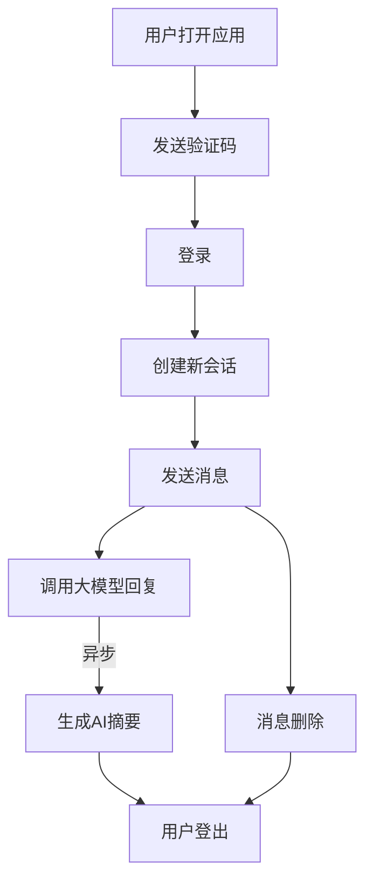
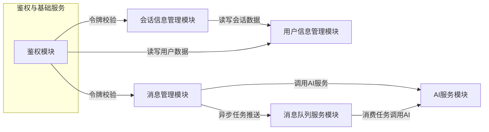
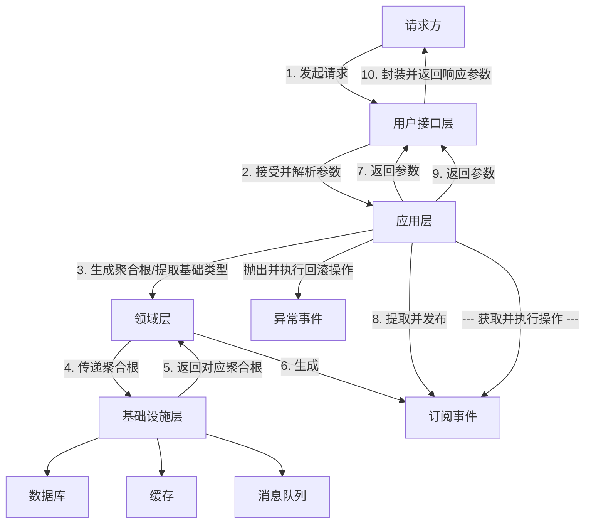
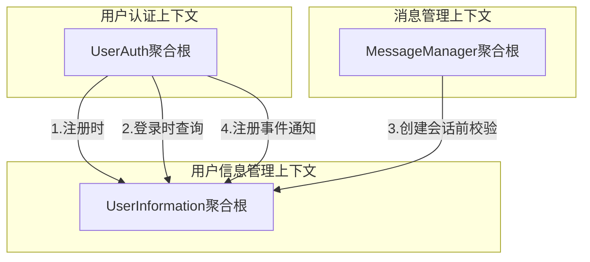
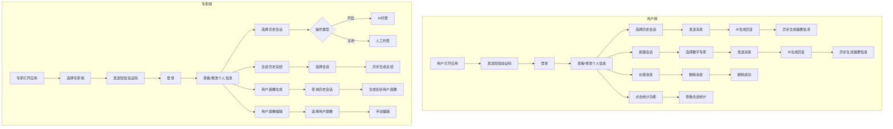
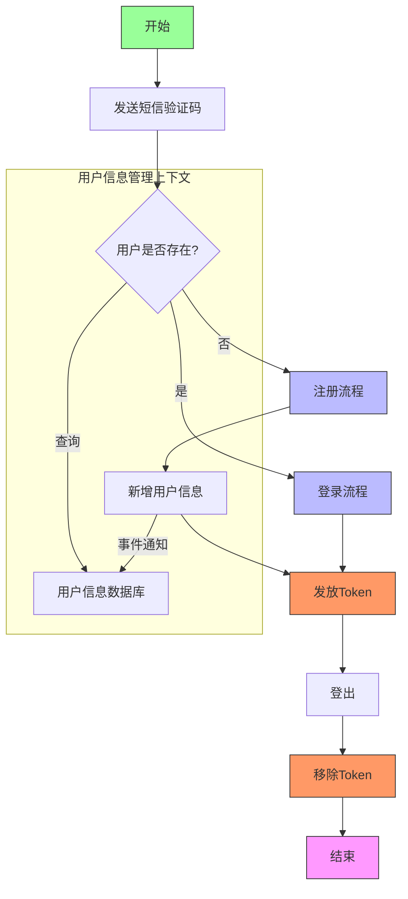
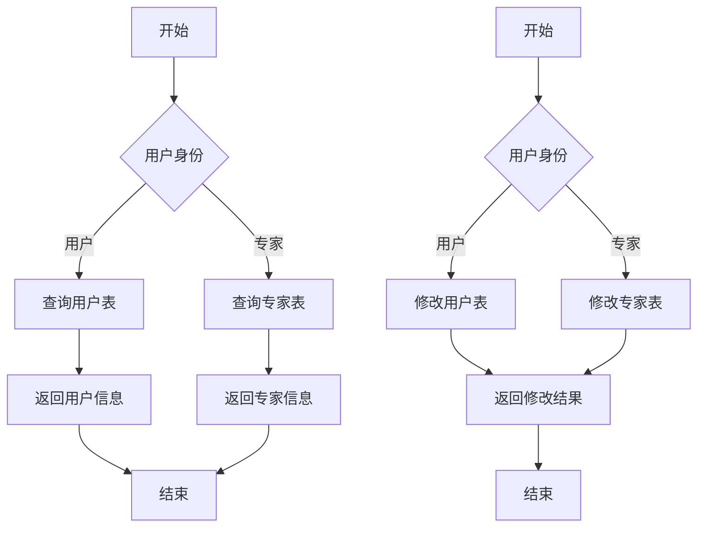
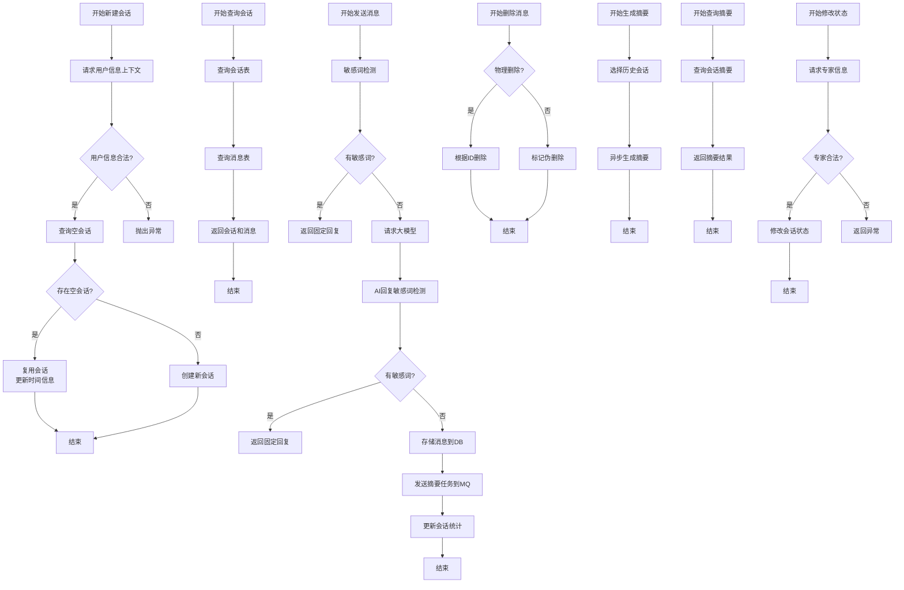
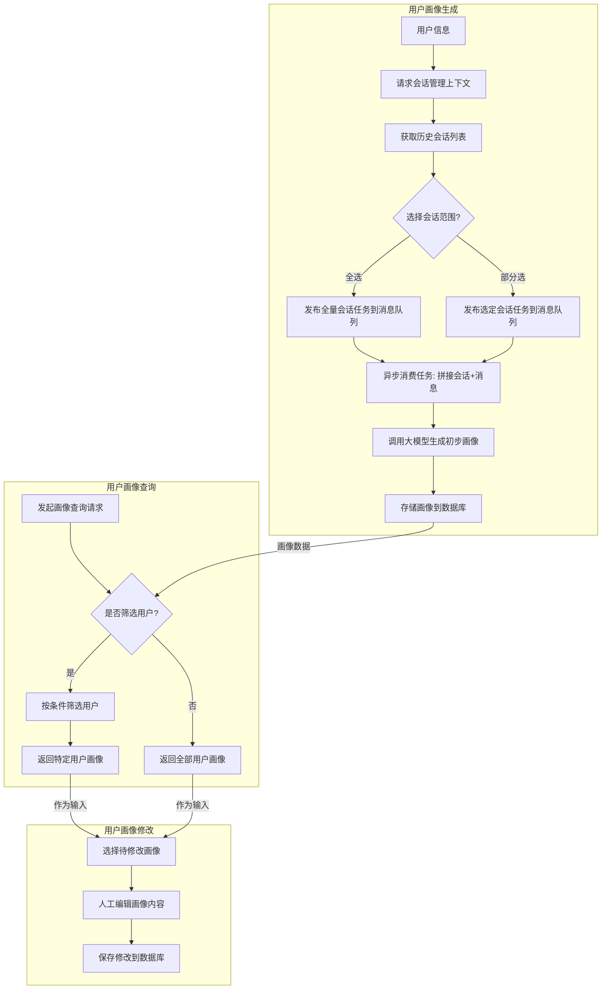
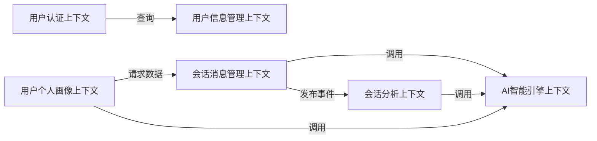

# 0828——技术探索：微服务拆分思想

## 前言

当单体应用膨胀到一定程度后，会出现以下的问题

1. **应用迭代慢**：修改少量代码，需要整个服务重新测试、部署，延缓迭代进度。
2. **扩容难**：只能整体扩容，流量高峰期间会造成资源浪费。
3. **架构问题**：不同模块之间调用关系混乱，维护迭代困难。

此时可以考虑进行微服务拆分，而微服务拆分本质上就是将庞大的单体应用，按照业务功能(非技术)，拆分多个小型、独立、松耦合的服务。每个服务：

1. 专注单一业务（如订单、支付、用户）
2. 拥有独立数据库（避免数据纠缠）
3. 可单独开发、部署、扩展

其核心思想是：高内聚（相关功能聚在一个服务内，如订单服务包含创建、查询、取消），低耦合（服务间通过 API/事件通信，而非直接调代码或共享数据库。）

## 拆分思想详细介绍

### 业务场景举例

#### 前言

为了方便为大家解释不同的拆分思想是如何进行拆分的，我们为大家提供一个适当复杂度的业务闭环场景，可以区分出不同的拆分思想的拆分结果。

#### 业务闭环场景

用户打开应用 ——> 发送验证码 ——> 登录 ——> 创建新会话 ——> 发送消息 ——> 调用大模型回复 ——> 异步调用 AI 生成摘要信息 ——> 消息删除 ——> 用户登出

#### 业务流程图示例



#### 功能初步拆分

我们通过上述的业务闭环流程，可以提取出以下功能。

1. 短信验证码发送：`POST /auth/code`
2. 用户短信验证码登录：`POST /auth/token`
3. 创建新会话：`POST /chats`
4. 发送消息：`POST /messages`
5. 删除消息：`DELETE /messages/{messageId}`
6. 用户登出：`DELETE /auth/token`

#### 结尾

随后我们将通过此闭环业务，使用不同的微服务拆分思想，进行逐步拆分，通过最后不同的拆分结果对比，体现出各拆分思想的区别，以及适用场景。

### 技术驱动型

#### 简单介绍

技术驱动型，是按照**技术隔离优先、业务次之兼顾**进行模块切割。核心就是按照使用的不同技术栈组合，进行不同程度的拆分。

这样的拆分思想，可以保证**每个服务专注于一种技术**；并可以按需进行对应的**优化扩展**。本质上是保证**技术彻底解耦**（AI 服务可以直接用 Python，Java 可以直接写对应的增删改查）。但是代价就是业务闭环被拆的**更加碎片化**，一个接口可能会**跨多个技术栈**。

技术驱动型拆分，适合**技术栈差异极大**（例如 AI 用 Python、C++ 写高并发），以及**技术需求冲突**场景。适合的是**技术复杂度远大于业务复杂度**的项目。如果非必要，不建议按照这种形式拆分。

#### 业务场景分析

##### 前言

我们通过 1.1 提出的业务场景例子，使用技术驱动型拆分思想进行前置分析，探讨如何进行模块拆分。

##### 分析

1. 我们首先要知道，技术驱动拆分，本质上是根据**技术栈使用的组合**，以**技术隔离优先、业务次之兼顾**进行的模块切割。因此我们可以首先提取出来**对应的**、**抽象层面**的技术栈。
2. 我们根据每个流程点，进行技术栈的分析

   - **短信验证码发送**：缓存层校验是否操作频繁 ——> 业务层生成随机验证码 ——> 配合 TTL 缓存结果，实现验证码 N 分钟有效期 ——> 发送任务到消息队列 ——> 返回结果。 消息队列消费 ——> 调用第三方服务发送短信验证码。
   - **用户短信验证码登录**：手机号校验 ——> 缓存层比对验证码 ——> 数据库操作 ——> 调用令牌技术生成令牌 ——> 返回结果
   - **创建会话**：用户信息校验 ——> 数据库操作 ——> 返回操作结果
   - **发送消息**：数据库操作 ——> 调用 AI 服务获取回复 ——> 数据库存储 ——> 发送任务到异步队列（摘要生成） ——> 返回结果
   - **消息删除**：数据库删除操作
   - **用户登出**：删除对应令牌即可
3. 我们可以根据流程，进行技术栈的一一提取：

   - 短信验证码发送：**缓存、消息队列**，鉴权/用户模块业务。
   - 用户登录：**缓存、数据库、令牌技术**，鉴权/用户模块业务。
   - 创建会话：**数据库，**会话模块业务，隐性调用用户模块。
   - 发送消息：**缓存（会话记忆）、AI 服务、消息队列（异步任务）、数据库**，消息模块业务。
   - 消息删除：**缓存（会话记忆）、数据库**，消息模块业务。
   - 用户登出：**令牌技术**，鉴权/用户模块业务。
4. 我们根据**技术隔离优先、业务次之兼顾**的原则，进行技术栈匹配分析：

   - 首先用户登出的技术栈**包含于**用户登陆的技术栈，且二者的**业务归属一致**。
   - 其次短信验证码技术栈**部分包含于**用户登录的技术栈，且二者的**业务归属一致**。
   - 而**独立出来**的数据库、消息队列技术栈，数据库则是负责用户的信息管理，消息队列我们可以随后继续分析。
   - 我们可以首先提取出来，短信验证码发送、用户登录、用户登出，划分为两个技术模块：**鉴权模块 + 用户信息管理模块**
   - 然后我们也分析到：消息删除技术栈**包含于**发送消息技术栈，同属于消息模块业务。
   - 而多出的 **AI 服务、消息队列**，我们需要进一步分析：消息队列也用到了 **AI 服务**，且 AI 服务、消息队列也**不局限于文本信息回复、异步摘要生成**。因此我们额外提取 AI 服务，消息队列服务。
   - 由此我们可以从发送消息、消息删除中切割出来两个模块：**AI 服务模块**与**消息管理模块**。
   - 最后是创建会话，我们直接拆分为会话管理模块即可。

##### 拆分结果

1. **鉴权模块**：**缓存 + 令牌技术**，负责_短信验证码发送、用户登录、用户登出_。
2. **用户信息管理模块**：**数据库**，负责_用户信息管理_。
3. **AI 服务模块**：**大模型相关技术**，负责_文本消息回复，对话摘要生成_。
4. **消息队列服务模块**：**消息队列技术**，负责_任务异步解耦_。
5. **消息管理模块**：**数据库**，负责_发送消息、删除消息_。
6. **会话信息管理模块**：**数据库**，负责会话创建。

#### 拆分结果分析

我们针对 1.2.2 的拆分结果，进行详细分析，其优势以及劣势分别是什么

各模块之间的调用关系

1. **鉴权模块 → 用户信息管理模块**

   - 用户登录/登出时读写用户基础数据
   - 短信验证码发送时校验用户状态
2. **消息管理模块 → AI 服务模块**

   - 发送消息时同步调用大模型生成回复
3. **消息管理模块 → 消息队列服务模块**

   - 推送摘要生成等异步任务到消息队列
4. **消息队列服务模块 → AI 服务模块**

   - 消费队列任务时调用 AI 生成摘要
5. **会话信息管理模块 → 用户信息管理模块**

   - 创建会话时关联用户数据
6. **鉴权模块 → 消息管理模块/会话信息管理模块**

   - 所有消息/会话操作需先通过令牌校验

图示如下：



优势：

1. **各个模块可以拥有独立的技术栈**，例如 AI 服务模块可以独立使用 Python 相关技术栈，消息队列服务可以任意更换 RabbitMQ 或者 Kafuka，不会影响其他模块。
2. **符合高内聚低耦合、单一职责原则**，各模块均单独负责自己的职责，例如 AI 服务专注提供大模型的功能使用，其他模块仅需调用 AI 服务提供的接口即可获取结果，无需关心 AI 服务模块内部的功能实现。
3. **更加定制化的优化**：可以按需进行扩展（例如本地部署 AI 服务可以单独扩展 GPU 资源）。

劣势：

1. **单业务线被拆散**：用户登录流程，需**跨鉴权模块、用户信息管理两大模块**；消息发送，需**跨消息管理、AI 服务调用、消息队列三大模块**。**流程越复杂，拆分后模块越多，跨模块越多，接口响应延迟越高**。
2. **运维复杂度提升**：单接口调试**需要跨多技术模块**，**调试、部署、监控的成本提升**。

#### 总结

1. **非必要不使用技术驱动拆分思想**，因为单业务线拆散，会导致接口响应提升 + 运维复杂度提升。收益低于复杂度提升。
2. **技术复杂度 >> 业务复杂度，且容忍响应延时提升**，可以考虑使用技术驱动拆分。如果团队使用混合技术栈，技术驱动型可以更适配不同技术栈的个性化需求。例如底层设施建设、算法平台。

### 领域驱动型（DDD）

#### 简单介绍

DDD(领域驱动设计)是用**业务语言**（而非技术术语）设计系统，将复杂系统拆分为**高内聚**的**限界上下文**（Bounded Context），每个上下文自治且明确职责。

#### 关键术语介绍

- **领域模型**：业务逻辑的**抽象**（如“订单”包含创建、支付、取消等行为）。
- **限界上下文**：业务能力的**自然边界**（如“订单上下文”只管订单生命周期，不涉及库存扣减）。
- **统一语言**：团队用同一套业务术语（避免“用户”在认证和订单中含义混淆）。

#### 如何拆分？

##### 拆分原则

- **业务优先**：技术为业务服务，而非相反。
- **上下文自治**：自己的数据自己管，外部依赖通过接口/事件协作。
- **分层架构**：分离领域逻辑（业务核心）与技术实现（数据库、API 等）。

##### 方法论提取

1. 首先看**业务优先**，在 1.3 技术驱动型中，我们首先通过提取**技术栈，合并组合**作为拆分依据。而业务优先，则是通过**业务场景**进行组合，作为模块拆分依据。
2. 其次看**上下文自治**，其追求的是**业务线高度内聚**，一条业务线中，**尽可能**管理**自身模块的数据的读写操作**，而如果需要外部数据，则**允许通过读操作****同步读取**外部上下文的数据，但是不允许同步修改外部上下文的数据（因为会产生**数据耦合**）。而当本模块涉及到其他模块的修改操作时候，则需要通过**异步解耦**，防止本模块与外部模块产生数据操作耦合。
3. 最后看**分层架构**：其本意是**面向抽象**设计系统，其和系统的架构设计相同，都追求**泛用性**，即不管技术栈如何更换，都**适配**当前的架构设计。也就是说，通过业务语言描述业务线，不涉及具体的技术栈，而是**抽象为泛化的业务语言**。

   1. _以用户登录业务线举例_：
      - 获取用户手机号 + 验证码，使用 Redis 进行频繁操作校验，查询 Redis 中存储的缓存，使用 Mybatis-Plus 查询 MySQL 数据库，并进行随后的操作。（❌ 错误示例，Mybatis-Plus、Redis 等都是具体的技术栈） 2. 获取用户
      - 获取用户手机号 + 验证码，通过缓存进行频繁操作校验 + 查询验证码，并查询数据库，进行随后的操作。（✔ 正确示例，不管技术栈如何更换，都适配当前的业务线描述）
   2. 而 DDD 中的分层架构也是这种形式，通过定义接口，而在底层的实现类中使用具体的技术栈。这种形式，不管底层技术栈如何更换，只需要进行实现接口，即可适配当前的业务线。
      - 例如：缓存操作，通过 CacheProvider 接口，底层则是通过 CacheRedisProvider，并引入 Redis 相关组件，即可通过接口，使用 Redis 实现该业务描述。
      - 同时我们要注意：业务语言不要渗透进基础设施层中，保证业务语言高度聚合在领域层中。

##### 总结

1. 保证**业务线高度内聚**，我们可以通过**业务线闭环**作为拆分依据。站在用户角度，哪些操作是**小闭环**？该小闭环就可以作为一次限界上下文操作依据。因为业务闭环线中的操作**不依赖外部逻辑**，其中不会出现其他分支；并且**业务闭环内操作在闭环中即可完成**。例如：**用户账密登录——> 用户登出**，就是用户操作的其中一个小闭环，因此两个业务线形成了一次**业务闭环，**可以拆分为：**用户认证上下文**。
2. 同时**分层逻辑**，本质上是**面向接口编程**。该思想不仅仅适用于 DDD，也适用于任何需要**封装**缓存操作、数据库操作、消息队列操作的场景。调用方只需要通过接口即可完成交互，无需关心接口的具体技术实现。

#### 聚合根

##### 介绍

1. 聚合根是**业务一致性的守护者**，每个聚合根是一个**独立业务单元**，负责维护其**内部所有对象的数据完整性和规则**（如 `订单聚合根` 包含订单项、支付状态，确保总金额一致）。
2. 同时聚合根也是**唯一入口，**外部只能通过聚合根**操作其内部对象**（如修改订单项必须通过订单聚合根）。
3. 聚合根中通常**包含业务规则**，例如格式校验，或者库存扣减。也就是说，针对于**数据项的修改**，通常需要**下沉**到领域模型中，避免在领域层中外部操作。
4. 一个聚合根通常代表了一个**事务边界**，也就是说，从一个聚合根创建开始，通常代表着写操作的执行，聚合根在其中的数据项改动，都需要对应事务操作。而针对**跨领域事件**（例如订单支付对应着库存扣减），则需要聚合根**发布事件**，在应用层中进行**事件监听**并调用聚合根执行操作。

##### 领域模型

1. 通常一个领域模块中会出现多个实体类，例如 `订单模型+物流模型`，但是其都会由聚合根统一管理。
2. 关键区别：

   - 聚合根 = 事务原子性的最小单元
   - 领域模型 = 业务语义的多样化表达

例如：`订单聚合根` 管辖 `订单实体`+`订单项值对象`+`折扣策略模型`

##### 事件发布

有些情况下，一个领域服务的执行，会涉及到其他模块的**修改操作**。例如订单操作中，会涉及到 `订单支付`，从而涉及到 `库存扣减`。而库存扣减操作则是对应了**另一个模块**的修改操作。而领域驱动通常遵循领**域自治**，即只允许操作自身数据。因此就需要进行**解耦操作**，而事件发布则是解耦跨聚合根的利器。

而事件发布通常是**推荐在应用层中**进行。发布时机是在完成领域服务的调用后，并且接受领域事件也是在应用层中完成。避免引入额外依赖，破坏聚合根的纯净性。

#### DDD 架构层

##### 介绍

1. DDD 架构层通过**职责分离**和**关注点隔离**，确保业务逻辑（领域层）与技术实现（基础设施层）**解耦**。以下是核心分层及其作用：
   用户接口层（User Interface / Presentation Layer）
   - 职责：处理用户输入（HTTP 请求、CLI 命令等），返回响应（JSON/HTML）。
   - 关键点：
     - 不包含业务逻辑，**仅做参数校验、数据格式转换**（如 DTO → 领域对象）。
     - 示例：Spring MVC 的 `Controller`、GraphQL 的 `Resolver`。

   1. 应用层（Application Layer）

   - 职责：协调领域对象完成业务用例，处理事务、权限、事件发布等跨聚合根的操作。
   - 关键点：
     - 无业务状态：仅调用领域层的能力，自身不实现业务规则。
     - 示例：`OrderService` 中调用 `Order聚合根` 支付，并发布 `OrderPaidEvent`。

   1. 领域层（Domain Layer）

   - 职责：承载核心业务逻辑，包含聚合根（Aggregate Root）、实体（Entity）、值对象（Value Object）、领域服务（Domain Service）。
   - 关键点：
     - 高内聚：所有业务规则（如“订单总额必须 >0”）在此层实现。
     - 技术无关：不依赖数据库、缓存等具体技术（通过接口抽象）。

   1. 基础设施层（Infrastructure Layer）

   - 职责：提供技术实现支撑（数据库、消息队列、外部 API 等）。
   - 关键点：
     - 实现领域层的接口：如 `OrderRepository` 接口的 MySQL 实现。
     - 反向依赖：领域层定义接口，基础设施层适配（依赖倒置原则）。

##### 架构调用分析

1. **用户接口层**：接受请求，解析参数，并转化为对象，调用应用层。接受返回参数，并封装响应对象返回调用方。
2. **应用层**：接受参数，创建为聚合根/获取基础类型，作为参数传给领域服务，接受返回参数，提取并发布事件。

   - 应用层也负责订阅事件，接受事件后，会调用对应的聚合根进行操作。
   - 针对领域层抛出的异常，部分情况下，应用层也会进行对应的捕捉，并执行回退操作（例如订单支付失败，会日志输出，并进行对应的回退操作（库存返回））
3. **领域层**：接受应用层参数，并执行完成的业务线，期间会调用其他的组件，例如缓存、数据库等，会通过接口进行交互，涉及到跨模块操作，会在聚合根中进行对象创建。处理完所有操作后会将对应的数据（聚合根/基础类型）返回到应用层。
4. **基础设施层**：接受领域层参数，并进行对应的操作。**无业务感知**，同时返回类型必须是**基础类型/聚合根类型**。防止基础设施层侵入领域层。



#### 业务场景分析

##### 前言

我们在 1.3.3.3 总结中，得出了使用**业务线闭环**作为限界上下文的拆分依据，因此我们这一次的业务场景分析，可以使用业务线闭环拆分。通过构建**更细致的业务闭环线**，来进行模块划分。

##### 分析

1. 当前的流程如下（1.1.2）

> 用户打开应用 ——> 发送验证码 ——> 登录 ——> 创建新会话 ——> 发送消息 ——> 调用大模型回复 ——> 异步调用 AI 生成摘要信息 ——> 消息删除 ——> 用户登出

1. 我们依次进行最小闭环线提取
   1. 我们首先提取出：发送验证码 ——> 登录 ——> 用户登出，因为该流程不依赖其他的数据，且符合业务线闭环。因此可以作为闭环线之一。
   2. 创建新会话 ——> 发送消息 ——> 调用大模型回复 ——> 异步调用 AI 生成摘要信息 ——> 消息删除。该业务闭环线承载了消息的生命流程，并且不依赖前面的闭环线的数据。
   3. 并且前两个闭环线中还有隐性的业务流程：
      - 发送验证码 ——> 查询用户信息 ——> 登录 ——> 用户登出
      - 校验用户信息合法性 ——> 创建新会话 ——>  发送消息 ——> 调用大模型回复 ——> 异步调用 AI 生成摘要信息 ——> 消息删除

##### 聚合根分析

1. 从上面的分析中，我们可以提取出来两条业务线，且两条业务线互不依赖，因此我们可以拆分为两个模块：用户认证管理上下文、消息管理上下文。
2. 同时我们进行聚合根的分析

   1. 第一个闭环线如下

   > 发送验证码 ——> 登录 ——> 用户登出
   >

我们可以得出，该闭环线与用户认证高度相关，因此我们可以提取出来：用户认证聚合根（UserAuth），其成员变量至少包含：手机号，验证码，用户实体。

我们可以得出，该闭环线与会话、消息高度相关，因此可以提取消息管理聚合根（MessageManager），其成员变量至少包含：会话实体、消息实体。

#### 拆分结果分析

我们在 1.3.6 拆分的结果是：用户认证上下文 + 用户认证聚合根（UserAuth）、消息管理上下文 + 消息管理聚合根、用户信息管理上下文 + 用户信息管理聚合根。

其之间的调用关系如下：

1. 用户认证上下文中，如果是注册，会从用户信息管理上下文中进行查询必要信息，并通过事件发布，让用户信息管理上下文进行新用户创建。如果是登录，则只会从用户信息管理上下文查询必要信息。
2. 消息管理上下文中，创建新会话前，会从用户信息管理上下文中查询必要信息进行合法性校验，随后再执行其他操作。



#### 总结

1. 领域驱动型拆分思想，本质上是根据业务线闭环，实现模块内高度自治。尽可能减少模块之间的互相调用。并通过事件发布/订阅机制进行解耦。
2. 该拆分思想以业务优先，并符合高内聚低耦合的思想。同时也是微服务主流的拆分方案。
3. 纯 DDD 拆分，其工作量可能会增加很多，因此现实情况中也推荐进行**技术驱动 +DDD 混合**拆分，针对中间件例如消息队列、AI 服务，可以考虑通过技术驱动单独拆分出来模块，防止每个模块单独构建服务重复造轮子。

## 混合驱动型实战演示

### 简单介绍

混合驱动拆分思想是结合 **业务边界（如 DDD 划分）** 和** 技术需求（如性能、扩展性、团队能力）** 的微服务拆分策略，兼顾**领域逻辑合理性**与**技术实现灵活性**，避免单一维度的局限性。

核心要点：

1. **业务优先**：DDD 划分领域和限界上下文，确保高内聚。
2. **技术补充**：按性能（如高频接口独立）、技术异构（如 AI 模块用 Python）、团队分工等调整拆分。
3. **平衡取舍**：避免过度拆分（如交易强一致需合并服务）。

### 业务场景举例

#### 前言

我们之前使用了一次小型闭环的业务场景，进行了**技术驱动型** + **领域驱动型**的拆分思想讲解，这次我们使用混合驱动型，并使用更加复杂的业务场景，进行技术驱动型 + 领域驱动型的混合拆分思想演示。

#### 业务场景介绍

之前的业务闭环如下

> 用户打开应用 ——> 发送验证码 ——> 登录 ——> 创建新会话 ——> 发送消息 ——> 调用大模型回复 ——> 异步调用 AI 生成摘要信息 ——> 消息删除 ——> 用户登出

我们在这个闭环的基础上进行如下拓展

1. 增加 AI 服务的调用场景
2. 增加消息队列服务调用场景
3. 适当拓展其他的业务场景

---

修改后的业务业务闭环描述

1. 用户端

   1. 用户打开应用 ——> 发送短信验证码 ——> 登录 ——> 查看/修改个人信息。
   2. 选择历史会话 ——> 发送消息 ——> AI 生成回复 ——> 异步持续生成摘要信息。
   3. 新建会话 ——> 选择数字专家 ——> 发送消息 ——> AI 生成回复 ——> 异步生成摘要信息。
   4. 长按选择某轮会话消息 ——> 删除消息 ——> 删除成功。
   5. 点击统计功能 ——> 查看个人的会话统计（会话数、消息数等）
2. 专家端

   1. 专家打开应用 ——> 选择专家端 ——> 发送短信验证码 ——> 登录 ——> 查看/修改个人信息。
   2. 选择历史会话 ——> 打开分身功能 ——> 转为 AI 托管。
   3. 选择历史会话 ——> 关闭分身功能 ——> 转为人工托管。
   4. 选择会话历史总结功能 ——> 选择会话 ——> 异步生成总结。
   5. 选择用户画像生成功能 ——> 查询该用户所有历史会话 ——> 选择/全选会话 ——> 生成初步用户画像。
   6. 选择用户画像编辑功能 ——> 选择用户画像 ——> 手动编辑。

#### 业务场景流程分析

我们根据对应的流程，生成对应的流程图如下：



Mermaid 对应代码如下

```
flowchart TD
    %% 用户端流程
    subgraph 用户端
        A[用户打开应用] --> B[发送短信验证码]
        B --> C[登录]
        C --> D[查看/修改个人信息]
        
        D --> E1[选择历史会话]
        E1 --> F1[发送消息]
        F1 --> G1[AI生成回复]
        G1 --> H1[异步生成摘要信息]
        
        D --> E2[新建会话]
        E2 --> F2[选择数字专家]
        F2 --> G2[发送消息]
        G2 --> H2[AI生成回复]
        H2 --> I2[异步生成摘要信息]
        
        D --> E3[长按消息]
        E3 --> F3[删除消息]
        F3 --> G3[删除成功]
        
        D --> E4[点击统计功能]
        E4 --> F4[查看会话统计]
    end

    %% 专家端流程
    subgraph 专家端
        X[专家打开应用] --> Y[选择专家端]
        Y --> Z[发送短信验证码]
        Z --> W[登录]
        W --> V[查看/修改个人信息]
        
        V --> U1[选择历史会话]
        U1 --> T1{操作类型}
        T1 -->|开启| S1[AI托管]
        T1 -->|关闭| S2[人工托管]
        
        V --> U2[会话历史总结]
        U2 --> T2[选择会话]
        T2 --> S3[异步生成总结]
        
        V --> U3[用户画像生成]
        U3 --> T3[查询历史会话]
        T3 --> S4[生成初步用户画像]
        
        V --> U4[用户画像编辑]
        U4 --> T4[选择用户画像]
        T4 --> S5[手动编辑]
    end
```

### 模块初步拆分

#### 前言

我们此次采用的是领域驱动 + 技术驱动混合拆分。因此我们可以**先使用****最小闭环线****进行领域驱动**，划分**限界上下文边界**，再根据需求，进行**技术驱动**拆分优化。

而在初步划分好边界后，我们再进行接口文档的输出。防止模块重新划分导致的返工。

#### 最小闭环线划分

##### 用户端

1. **登录/登出**：发送短信验证码 ——> 登录 ——> 登出
2. **个人信息修改**：查询个人信息 ——> 修改个人信息
3. **消息相关**：

   1. 选择历史会话/新建会话 ——> 发送消息 ——> AI 回复 ——> 异步生成摘要
   2. 选择历史会话/新建会话 ——> 长按选择消息 ——> 删除
4. **功能统计**：点击统计功能 ——> 查看会话统计

##### 专家端

1. **登录/登出**：发送短信验证码 ——> 登录 ——> 登出
2. **个人信息修改**：查询个人信息 ——> 修改个人信息
3. **会话操作相关**：

   1. 选择历史会话 ——> 打开/关闭分身功能
   2. 会话历史总结 ——> 选择会话 ——> 异步生成摘要
4. **用户画像相关**:

   1. 选择用户画像生成功能 ——> 选择用户历史会话 ——> 生成用户初步画像
   2. 选择用户画像 ——> 查询用户画像 ——> 编辑用户画像

#### 初步上下文拆分

我们经过 2.3.3.1 与 2.3.3.2 的分析，已经得出了初步的最小闭环业务线。我们根据这些业务线，进行归类整理，即可得出初步的限界上下文。

1. 我们将双端的登录/登出功能进行合并，可以初步划分为**用户认证上下文**。聚合根是用户认证类（UserAuth）。
2. 再将双端的个人信息相关操作合并，可以初步得出**用户信息管理上下文**。聚合根是用户个人信息（UserInfo）。
3. 我们将用户端的消息相关、会话统计功能与专家端的会话操作相关进行合并（因为三者都与会话模块高度相关），可以初步得出**会话消息管理上下文**，聚合根是会话消息（ChatMessages）。
4. 最后我们将专家端的用户个人画像单独提取出来，形成**用户个人画像上下文**（因为画像生成与用户原始个人信息关联性不强），聚合根是用户个人画像（UserProfile）。

### 进一步分析模块拆分结果

#### 前言

我们经过 2.3 的分析与初步拆分，初步得出了**四个限界上下文**。随后我们针对每个上下文进行进一步的分析，观察上下游执行流程，以及负责的职责边界，来判断是否值得进行进一步的细分。

#### 用户认证上下文

##### 上下游流程分析

1. 根据手机号，发送短信验证码。
2. 根据手机号、验证码以及用户身份（User/Expert）进行用户信息查询（从用户信息管理上下文中获取）。
3. 根据用户信息查询结果，决定是走注册还是登录。

   1. 如果是注册，通过事件通知，新增用户信息。
   2. 如果是登录，直接放行。
4. 根据注册/登录结果，发放 Token。
5. 用户登出，移除 Token。

流程图如下




##### 进一步分析

1. 我们经过上下游流程分析，确认用户认证上下文符合职责单一原则（认证）。
2. 因此用户认证上下文是合理的，不需要进行技术驱动拆分等其他操作。

#### **用户信息管理上下文**

##### 上下游流程分析

1. 根据用户身份查询个人信息

   1. 如果是用户，查询用户表
   2. 如果是专家，查询专家表
2. 根据用户身份，修改个人信息

   1. 如果是用户，修改用户表
   2. 如果是专家，修改专家表
3. 图示如下



##### 进一步分析

1. 我们经过上下游流程分析，可以确定：用户信息管理上下文只负责用户个人信息的查询与修改，符合单一职责（管理用户个人信息）。
2. 因此用户信息管理上下文是合理的，不需要进行其他的修改。

#### **会话消息管理上下文**

##### 上下游流程分析

1. 提供新建会话功能

   1. 请求**用户个人信息上下文**，查询用户信息，校验用户身份、信息是否合法。
      1. 如果合法，继续流程。
      2. 如果非法，抛出异常，拒绝请求。
   2. 随后查询是否有空会话
      1. 如果有，会复用该会话，并修改创建会话日期等时间信息。
      2. 如果没有，就创建新会话。
2. 查询会话功能

   1. 查询对应的会话信息（会话表）
   2. 并查询对应的消息（消息表）
3. 发送消息

   1. 进行敏感词检测
      1. 如果有敏感词，就返回固定回复
      2. 如果没有，就继续后续流程
   2. 请求大模型，获取回复内容
   3. 针对 AI 回复进行敏感词检测
      1. 如果有敏感词，就返回固定回复
      2. 如果没有，就继续后续流程
   4. 将用户的消息、AI 回复消息一块添加进数据库中
   5. 将生成摘要任务发送到消息队列异步执行
   6. 更新用户的会话统计
4. 删除消息：根据消息 ID 删除，或者通过标识进行伪删除（根据业务需求选择即可）
5. 生成会话摘要功能

   1. 选择历史会话
   2. 查询历史会话 + 消息
   3. 将会话 + 消息发送给大模型，生成摘要
   4. 异步生成摘要
6. 查询会话摘要：根据会话摘要进行查询即可
7. 会话状态修改

   1. 修改前，会请求用户信息上下文，获取专家个人信息
      1. 如果专家不存在或者信息非法，会返回异常信息
      2. 如果合法，继续后续操作
   2. 修改会话状态即可
8. 流程图如下



##### 进一步分析

1. 我们通过流程分析发现：会话消息管理上下文的功能很多，那么所有功能是否都遵循单一职责？

   1. 新建会话：符合，全程只与用户上下文有信息交互
   2. 查询会话：符合，全程只涉及到会话与消息的查询
   3. 发送消息：大部分符合，但是最后的_会话信息统计_，是否真的符合单一职责？
      1. 会话消息管理，主要是针对会话、消息进行读写操作，而会话信息统计，_并不属于会话消息管理的范畴_。
      2. 因此我们考虑将最后流程的会话信息统计，提取出会话信息统计上下文，并通过事件发布，进行**异步更新**。
   4. 删除消息：符合，全程只涉及到消息表的操作
   5. 生成会话摘要
      1. 该功能主要针对的是_会话摘要_，也并不在会话消息的范畴中
      2. 尽管该功能高度依赖会话 + 消息的内容，但是主体是_会话摘要_，因此我们需要进行提取
   6. 查询会话摘要
      1. 该功能也是主要针对的_会话摘要_，也并不在会话 + 消息的范畴中
   7. 会话状态修改：符合，该功能主要涉及到了会话表的状态修改。
2. 经过第一点的分析，我们发现并提取出了两个不属于会话消息管理范畴内的模块：会话统计、会话摘要。
3. 我们将提取出的两个模块进行增量设计，可以得出：

   1. **会话统计上下文**，聚合根为会话统计（SessionStatistics）
   2. **会话摘要上下文**，聚合根为会话摘要（SessionSummary）
4. 同时我们针对新设计的两个上下文进行进一步评估，观察是否有合并的必要

   1. 会话统计、会话摘要，二者都是与会话消息内容有着高度相关的内容。
   2. 二者都是会话消息的衍生内容，因此我们可以直接合并二者，形成一个上下文
   3. 合并后的上下文，我们可以取名为**会话分析上下文**，主要职责是针对历史会话，进行统计、摘要等分析功能，聚合根为会话分析（SessionAnalytics）
5. 并且我们分析到：会话消息管理上下文，高频依赖 AI 服务调用（AI 回复 + 异步摘要），同时新增的会话分析，也是高频依赖到 AI 服务。我们可以考虑进行技术驱动提取，**防止** AI 相关类**分散到各个服务**中。我们可以根据以下分析进行衡量

   1. 如果团队的 AI 相关技术栈，和后端技术栈冲突（例如后端使用 Java，而算法端使用 Python），那么推荐通过技术驱动，将 AI 服务单独提取成 **AI 智能引擎上下文（AI 服务上下文也可，根据业务需求进行调整）**，其职责就是调用大模型生成特定的回复内容。聚合根为 AI 智能引擎（AiEngine）。
   2. 如果团队技术栈不冲突，且对性能比较敏感（无法容忍延时），那么不推荐拆分上下文。
   3. 如果团队技术栈不冲突，且可以容忍远程调用的延时，那么推荐拆分上下文，因为可以**提升可拓展性以及可维护性**。同时也符合**业务高内聚**原则。

#### 用户个人画像上下文

##### 上下游流程分析

1. 用户画像初步生成：

   1. 根据用户信息，请求会话管理上下文，获取到所有的历史会话列表
   2. 选择对应的历史会话列表（可以全选，也可以部分选）
   3. 根据选择内容，将任务发布到消息队列
   4. 异步进行任务，查询会话 + 消息，请求对应大模型生成用户初步画像
2. 用户画像查询：

   1. 根据大模型生成的初步画像，可以进行画像查询
   2. 可以针对不同的用户进行特定筛选
3. 用户画像修改

   1. 通过查询结果，选择某一个画像进行修改
   2. 将修改结果持久化进数据库即可
4. 流程图如下



##### 进一步分析

1. 我们从中可以发现，所有的操作都围绕着用户个人画像操作，且符合单一职责（用户个人画像管理）
2. 因此该上下文划分也是合理的

#### 总结

经过 2.4.2 ~ 2.4.5 的分析，我们可以确定最后的上下文如下

<table>
<tr>
<td>上下文名称<br/></td><td>核心职责<br/></td><td>聚合根<br/></td><td>关键交互说明<br/></td></tr>
<tr>
<td>用户认证上下文<br/></td><td>处理用户登录/注册及Token管理<br/></td><td>`Auth`<br/></td><td>依赖`用户信息管理上下文`查询用户数据；通过事件通知新增用户信息。<br/></td></tr>
<tr>
<td>用户信息管理上下文<br/></td><td>管理用户/专家基础信息增删改查<br/></td><td>`UserProfile`<br/></td><td>区分用户/专家角色；被认证、会话管理等上下文查询。<br/></td></tr>
<tr>
<td>会话消息管理上下文<br/></td><td>管理会话生命周期及消息收发<br/></td><td>`Session`<br/></td><td>依赖用户信息校验；调用`AI智能引擎`生成回复；发布消息到队列生成摘要/统计事件。<br/></td></tr>
<tr>
<td>会话分析上下文<br/></td><td>生成会话摘要及统计数据分析<br/></td><td>`SessionAnalytics`<br/></td><td>消费消息队列任务；依赖历史会话数据；调用`AI智能引擎`生成摘要。<br/></td></tr>
<tr>
<td>AI智能引擎上下文<br/></td><td>统一封装大模型调用能力<br/></td><td>`AiEngine`<br/></td><td>提供生成回复、摘要、画像等标准化接口；技术栈隔离（如Python服务）。<br/></td></tr>
<tr>
<td>用户个人画像上下文<br/></td><td>生成和管理用户画像<br/></td><td>`UserPortrait`<br/></td><td>依赖会话数据；调用`AI智能引擎`生成画像；支持人工修改。<br/></td></tr>
</table>

各上下文的调用关系如下



## 总结

1. 不论是技术驱动，还是领域驱动，最后都是需要**遵守单一职责原则**。亦或是技术自治，亦或是业务自治。都需要根据现实的资源限制，进行适当的妥协。
2. 通过前面所有分析，我们可以得出以下方法论：

   - 建议优先使用 DDD 领域驱动拆分思想，进行初步分析。
   - 优先拆分出所有的最小闭环业务线。
   - 根据最小闭环业务线进行初步的 DDD 领域驱动设计。
   - 再针对每个上下文，进行上下游流程分析，决定是否需要进一步细化或者合并。
   - 进一步分析的同时也考虑团队技术栈差异，并进行适当的利弊权衡，选择是否进行技术驱动拆分。
   - 最后验证拆分是否遵循**领域自治**、**单一职责**等原则。
3. 除了本文档讲述的技术驱动、领域驱动，还有其他很多的拆分思想，后续有机会也会一一讲解。但就当前来说，混合拆分思想已经足够应对大部分的微服务拆分场景。
